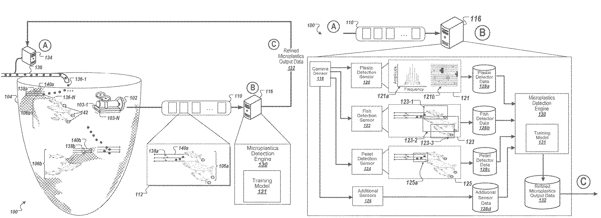

<table border="1">
  <tr>
    <td><b>TÍTULO </b></td>
    <td colspan="2">ACOPLAMIENTO DE SENSORES DETECTORES DE MICROPLÁSTICOS Y ENTRENAMIENTO DE DATOS</td>
  </tr>
  <tr>
    <td> CIP: G06V20/69 </td>
    <td colspan="2">Investigating or analysing materials by the use of optical means, i.e. using sub-millimetre waves, infrared, visible or ultraviolet light (G01N3/00 - G01N19/00 take precedence)</td>
  </tr>
  <tr>
    <td> NÚMERO DE PUBLICACIÓN </td>
    <td> US2024071072A1 </td>
    <td> IMAGEN </td>
  </tr>
  <tr>
    <td> Resumen </td>
    <td> Métodos, sistemas y aparatos, incluidos programas informáticos codificados en medios de almacenamiento informático, para recibir datos de sensores y perfeccionar un modelo de entrenamiento para detectores de microplásticos. En algunas implementaciones, un método ejemplar incluye recibir datos de detección de microplásticos de un sensor de detección de microplásticos y datos adicionales de uno o más sensores adicionales; proporcionar los datos de detección de microplásticos y datos adicionales de sensores a un modelo entrenado para detectar microplásticos; recibir uno o más valores que representan la cantidad de microplásticos a partir de los datos de detección de microplásticos y datos adicionales de sensores; y proporcionar una representación de uno o más valores de salida del modelo que describa la cantidad de microplásticos para uso por uno o más dispositivos usuarios.</td>
    <td>   </td>
  </tr>
  <tr>
    <td > LINK </td>
    <td colspan="3"> https://worldwide.espacenet.com/patent/search/family/089997042/publication/US2024071072A1?q=pn%3DUS2024071072A1 </td>
  </tr>
</table>

<table border="1">
  <tr>
    <td><b>TÍTULO </b></td>
    <td colspan="2">    </td>
  </tr>
  <tr>
    <td>     </td>
    <td colspan="2">     </td>
  </tr>
  <tr>
    <td> NÚMERO DE PUBLICACIÓN </td>
    <td>   </td>
    <td> IMAGEN </td>
  </tr>
  <tr>
    <td style="width:15%"> Resumen </td>
    <td style="width:40%">     </td>
    <td style="width:45%" >   </td>
  </tr>
  <tr>
    <td > LINK </td>
    <td colspan="3">   </td>
  </tr>
</table>

